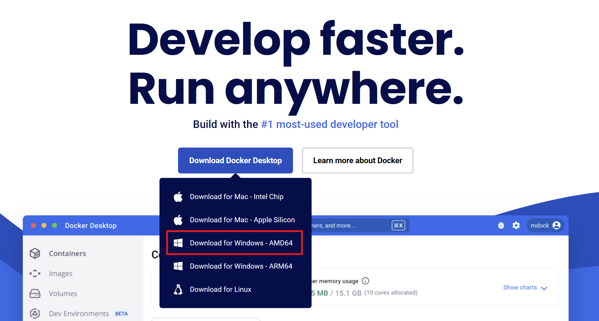
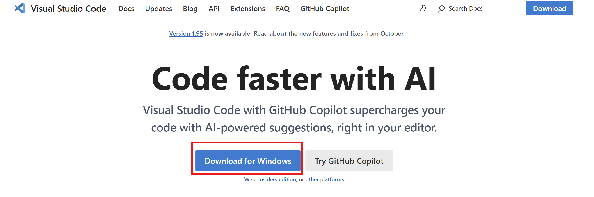
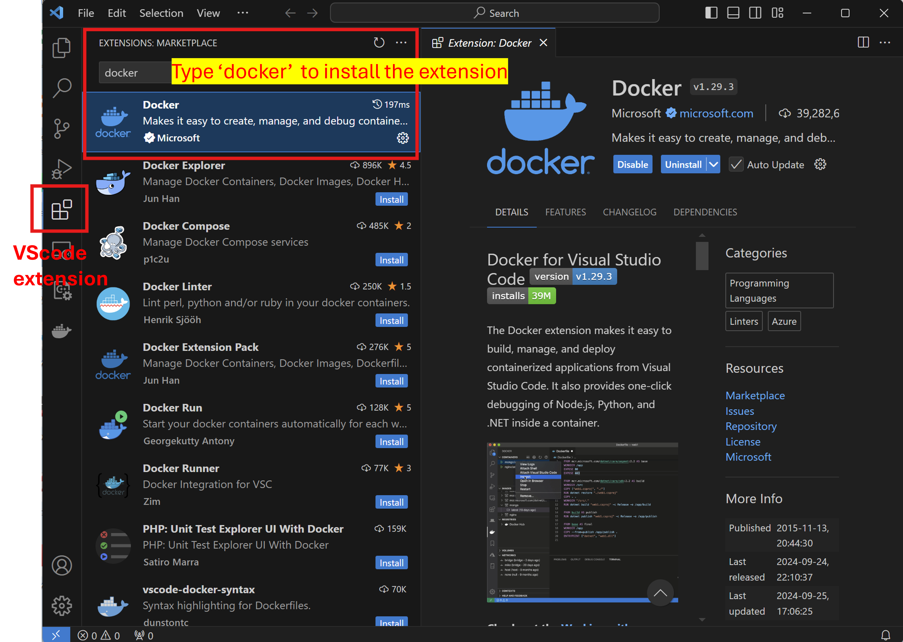
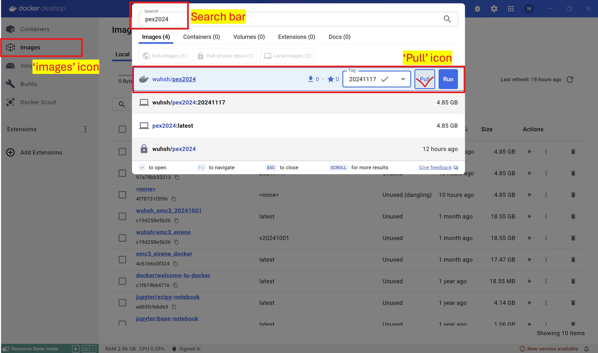
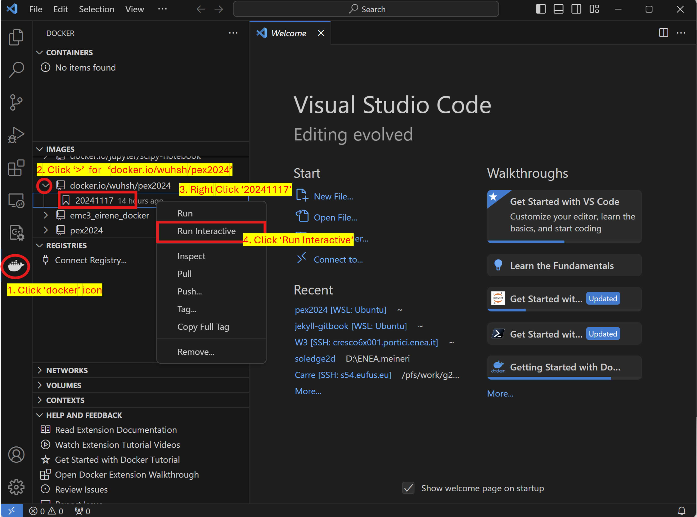
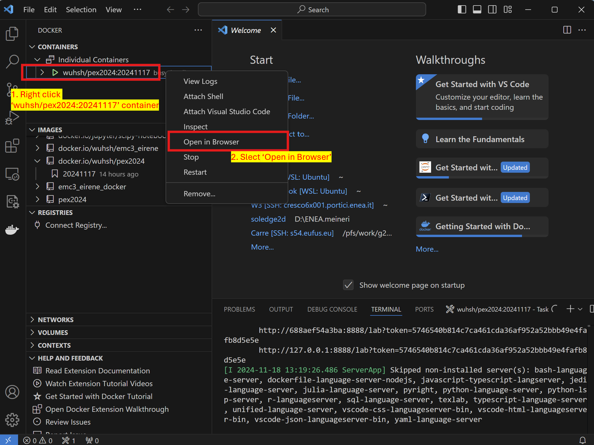
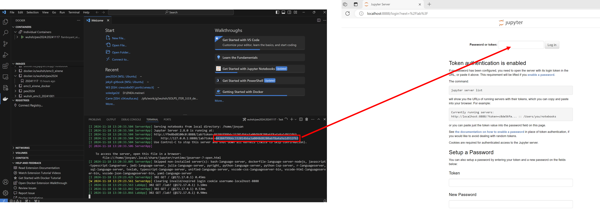
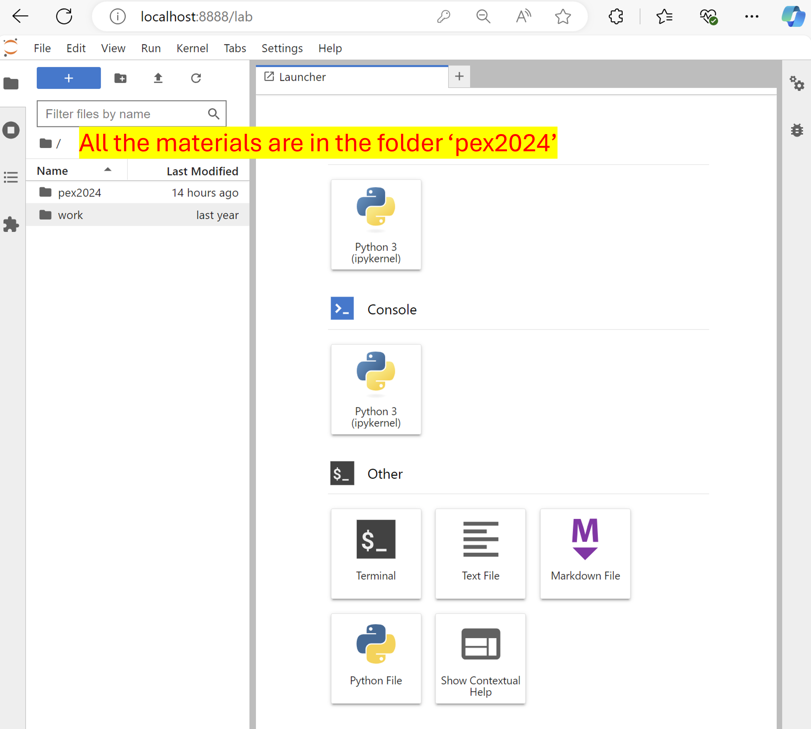

In this workshop, we will use [Jupyter Notebook](https://jupyter.org/) as the GUI to do some exercises. All the necessary materials (exercises, simulation data, numerical tools etc.) are already contains in a [Docker image](https://www.docker.com). The docker image contains everything needed to run a piece of software, including the code, runtime, libraries, environment variables, configuration files, and dependencies. We use [VScode](https://code.visualstudio.com/) to acess the docker container which is a running instance of a docker image.

You may have a question that Why do we use this format for the workshop? The answer is:

Because it provides a consistent, isolated, and portable way for all participants. This reduces setup time, minimizes compatibility issues, and allows everyone to focus on the detailed physics and do not waste time on configure the setup of environment.

In this page, we provide the instructions about how to install the Docker and Vscode step by step both for **Windows** and **Mac**.

## Fow Windows:

### Step1: Install Docker

In the [Docker official website](https://www.docker.com/) download the window version which is mark by red line as the following picture and then install the docker according to the instruction.

{: style="width: 60%;" }

***
### Step2: Install VScode

In the [VScode official website](https://code.visualstudio.com/) download the window version which is mark by red line as the following picture and then install the VScode according to the instruction.

{: style="width: 60%;" }

***
### Step3: Install Docker extension in VScode

After the successful installation of VScode, run the VScode. In the VScode, click the icon of 'Extensions'. In the search bar type "docker" and then install the "docker extension" in VScode. This step in shown in the following picture. Through the "docker extension", we can access the docker container direclty by VScode.

{: style="width: 60%;" }

***
**You can do the following steps by yourself or We can do the them together in the first time of hand-on session.**

### Step4: Download the pex2024 image in docker desktop

Run the docker program and then click the "Images" icon. In the search bar, type "pex2024" then you will see the coresponding image. Click the 'pull' botton to automatically install the coresponding image. 
This image contains all the necessary materials which are used for the hand-on sessions. 

{: style="width: 60%;" }

### Step5: Run the pex2024 container to create the container

As presented by the following picture, in the this step: 
1) In the VScode, click the 'docker' icon, then in the left, there are related items. 
2) In the 'IMAGES', find the 'docker.io/wuhsh/pex2024' image, which is downloaded in step4, and then click the '>' botton. 
3) Right click '20241117', which is the tag for the image. 
4) Click 'Run Interactive' that a container will be automatically build based on this image. 

{: style="width: 60%;" }

### Step6: Launch the container.

As presented by the following picture, in the this step: 
1) In the 'CONTAINERS' part of VScode, right click our container 'wuhsh/pex2024:20241117'. 
2) Select the 'Open in Browser'.

{: style="width: 60%;" }

### Step7: Start Jupyter Notebook through Browser.
Once you successfully open the container in your browser, you will see the right part of the following picture. Then please go to the 'TERNIMAL' part of VScode, as shown in the left, and copy the token and then paste it to the browser. 
{: style="width: 100%;" }

### Step8: Final step
If everything go well, in the browser you can see as the following picture. All of our hand-on sessions are based the jupyter nootbook.
{: style="width: 100%;" }

## Fow Windows:
The installations for Mac is similar to Windows, followings are the steps: 

### Step1: Install Docker

In the [Docker official website](https://www.docker.com/) download the window version which is mark by red line as the following picture and then install the docker according to the instruction.

{: style="width: 60%;" }